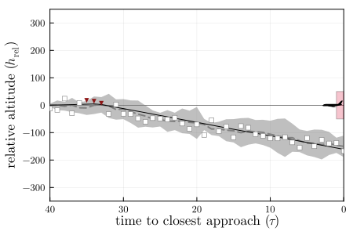

# CollisionAvoidancePOMDPs.jl

[](https://github.com/sisl/CollisionAvoidancePOMDPs.jl/actions/workflows/CI.yml)
[](https://codecov.io/gh/sisl/CollisionAvoidancePOMDPs.jl)


A simple aircraft collision avoidance POMDP in Julia (part of [POMDPs.jl](https://github.com/JuliaPOMDP/POMDPs.jl)).

Included is an implementation of the unscented Kalman filter for belief updating.

<p align="center">
    
</p>

```julia
@with_kw struct CollisionAvoidancePOMDP <: POMDP{Vector{Float64}, Float64, Vector{Float64}}
    h_rel_range::Vector{Real} = [-75, 75] # initial relative altitudes [m]
    dh_rel_range::Vector{Real} = [-1, 1]  # initial relative vertical rates [m²]
    ddh_max::Real = 1.0                   # vertical acceleration limit [m/s²]
    τ_max::Real = 40                      # max time to closest approach [s]
    actions::Vector{Real} = [-5, 0.0, 5]  # relative vertical rate actions [m/s²]
    collision_threshold::Real = 50        # collision threshold [m]
    reward_collision::Real = -100         # reward obtained if collision occurs
    reward_reversal::Real = -1            # reward obtained if action reverses direction (e.g., from +5 to -5)
    reward_alert::Real = -1               # reward obtained if alerted (i.e., non-zero vertical rates)
    px = DiscreteNonParametric([0.1, 0.0, -0.1], [0.25, 0.5, 0.25]) # transition noise on relative vertical rate [m/s²]
    σobs::Vector{Real} = [15, 1, eps(), eps()] # observation noise [h_rel, dh_rel, a_prev, τ]
    γ::Real = 0.99                        # discount factor
end
```

## Installation
```julia
] add https://github.com/sisl/CollisionAvoidancePOMDP.jl
```

## Usage
```julia
using CollisionAvoidancePOMDPs

pomdp = CollisionAvoidancePOMDP()
up = CASBeliefUpdater(pomdp)
policy = RandomPolicy(pomdp)

h = simulate(HistoryRecorder(), pomdp, policy, up)
```

## Unscented Kalman filter 🧼
_(Derivative free! How clean!)_

An implementation of the unscented Kalman filter (UKF) is included as a belief `Updater`.

> Mykel J. Kochenderfer, Tim A. Wheeler, and Kyle H. Wray, "Algorithms for Decision Making", [Chapter 19: Beliefs](https://algorithmsbook.com/files/chapter-19.pdf), _MIT Press_, 2022.

### UKF usage

```julia
using CollisionAvoidancePOMDPs

pomdp = CollisionAvoidancePOMDP()
up = UKFUpdater(pomdp; λ=1.0)

ds = initialstate(pomdp)
b::UKFBelief = initialize_belief(up, ds)
s = rand(b)
a = rand(actions(pomdp))
o = rand(observation(pomdp, a, s))
b′ = update(up, b, a, o)
```

### UKF implementation

```math
\begin{gather}
\mathbf{f}_T \texttt{ (POMDPs.transition)} \tag{transition dynamics function}\\
\mathbf{f}_O \texttt{ (POMDPs.observation)} \tag{observation dynamics function}
\end{gather}
```

```julia
@with_kw mutable struct UKFUpdater{P<:POMDP} <: Updater
    pomdp::P
    Σₛ # state covariance matrix
    Σₒ # obs. covariance matrix
    λ  # sigma point spread parameter
end
```

```julia
@with_kw mutable struct UKFBelief
    μ = missing # mean vector
    Σ = missing # covariance matrix
    ϵ = 1e-6 # added to covariance for numerical stability in sampling
end
```

### UKF prediction

Predict where the agent is going based on the nonlinear transition function $\mathbf{f}_T$.

#### Unscented transform:
Reconstruct updated mean and covariance based on a nonlinear transform $\mathbf{f}$ of the sigma points $\mathbf{s}_i$.

#### Reconstruct original mean and covariance:
If we wanted to reconstruct our provided mean and covariance using the generated sigma points $\mathbf{s}_i$, then we can use these equations (note, they don't pass the sigma points through the nonlinear function $\mathbf{f}$ like we do in the unscented transform).

```math
\begin{align*}
𝛍 &= \sum_i w_i 𝐬_i\\
𝚺 &= \sum_i w_i (𝐬_i - 𝛍)(𝐬_i - 𝛍)^\top
\end{align*}$$
```

### UKF update

1. Update observation model using predicted mean and covariance.
2. Calculate the _cross covariance matrix_ (measures the variance between two multi-dimensional variables; here it's the transition prediction $𝛍_p$ and observation model update $𝛍_o$).
3. Update mean and covariance of our belief.
```julia
function POMDPs.update(up::UKFUpdater, b::UKFBelief, a, o)
    μ, Σ, λ = b.μ, b.Σ, up.λ
    w = weights(μ, λ)

    # Predict
    fₜ = s -> rand(transition(up.pomdp, s, a))
    μₚ, Σₚ, _, _ = unscented_transform(μ, Σ, fₜ, λ, w)
    Σₚ += up.Σₛ

    # Update
    fₒ = sp -> rand(observation(up.pomdp, sp))
    (μₒ, Σₒ, Sₒ, Sₒ′) = unscented_transform(μₚ, Σₚ, fₒ, λ, w)
    Σₒ += up.Σₒ

    # Calculate the cross covariance matrix
    Σₚₒ = cross_cov(μₚ, μₒ, w, Sₒ, Sₒ′)

    # Apply Kalman gain belief
    K = Σₚₒ / Σₒ         # Kalman gain
    μ′ = μₚ + K*(o - μₒ) # updated mean
    Σ′ = Σₚ - K*Σₒ*K'    # updated covariance
    return UKFBelief(μ′, Σ′, b.ϵ)
end
```

### Sigma point samples:

Create a set of sigma point samples as an approximation for $𝛍′$ and $𝚺′$ that will be updated by the UKF (instead of updating the non-linear, multi-variate Gaussian directly). Common sigma points include the mean $𝛍 \in \mathbb{R}^n$ and $2n$ points formed from perturbations of $𝛍$ in directions determined by the covariance matrix $𝚺$:

```math
\begin{align*}
𝐬_1 &= 𝛍\\
𝐬_{2i} &= 𝛍 + \left(\sqrt{(n+\lambda)𝚺}\right)_i \quad \text{for } i \text{ in } 1\text{:}n\\
𝐬_{2i+1} &= 𝛍 - \left(\sqrt{(n+\lambda)𝚺}\right)_i \quad \text{for } i \text{ in } 1\text{:}n
\end{align*}$$
```

### Sigma point weights:

The sigma points are associated with the weights:

```math
\begin{align*}
\lambda &= \text{spread parameter}\\
w_i &= \begin{cases}
\frac{\lambda}{n+\lambda} & \text{for } i=1\\
\frac{1}{2(n+\lambda)} & \text{otherwise}
\end{cases}
\end{align*}
```
